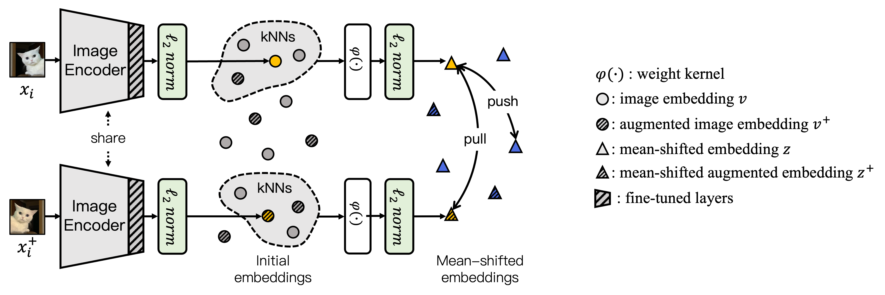

<div align="center">
  <h1> Contrastive Mean-Shift Learning 
  for Generalized Category Discovery </h1>
</div>

<div align="center">
  <h3><a href=http://sua-choi.github.io>Sua Choi</a> &nbsp;&nbsp; <a href=http://dahyun-kang.github.io>Dahyun Kang</a> &nbsp;&nbsp; <a href=https://cvlab.postech.ac.kr/~mcho>Minsu Cho</a> 
  <h4> Pohang University of Science and Technology (POSTECH)
  <h4>[<a href=http://arxiv.org/abs/2404.09451>Paper</a>] [<a href=https://cvlab.postech.ac.kr/research/cms>Project page</a>]
</div>
<br />


</div>
<br />
<div align="center">
  
</div>

<!-- <p align="center"> 
  
  
</p> -->


## Environmnet installation
This project is built upon the following environment:
* [Python 3.10](https://pytorch.org)
* [CUDA 11.7](https://developer.nvidia.com/cuda-toolkit)
* [PyTorch 1.13.1](https://pytorch.org)

The package requirements can be installed via `requirements.txt`, 
```bash
pip install -r requirements.txt
```

## Datasets
We use fine-grained benchmarks in this paper, including:
* [The Semantic Shift Benchmark (SSB)](https://github.com/sgvaze/osr_closed_set_all_you_need#ssb) and [Herbarium19](https://www.kaggle.com/c/herbarium-2019-fgvc6)

We also use generic object recognition datasets, including:
* [CIFAR100](https://pytorch.org/vision/stable/datasets.html) and [ImageNet](https://image-net.org/download.php)

Please follow [this repo](https://github.com/sgvaze/generalized-category-discovery) to set up the data.

Download the datasets, ssb splits, and pretrained backbone by following the file structure below and set `DATASET_ROOT={YOUR DIRECTORY}` in `config.py`.

```
    DATASET_ROOT/
    ├── cifar100/
    │   ├── cifar-100-python\
    │   │   ├── meta/
    │       ├── ...
    ├── CUB_200_2011/
    │   ├── attributes/
    │   ├── ...
    ├── ...
```
```
    CMS/
    ├── data/
    │   ├── ssb_splits/
    ├── models/
    │   ├── dino_vitbase16_pretrain.pth
    ├── ...
```


## Training
```bash
bash bash_scripts/contrastive_meanshift_training.sh
```
Example bash commands for training are as follows:
```bash
# GCD
python -m methods.contrastive_meanshift_training  \
            --dataset_name 'cub' \
            --lr 0.05 \
            --temperature 0.25 \
            --wandb 

# Inductive GCD
python -m methods.contrastive_meanshift_training  \
            --dataset_name 'cub' \
            --lr 0.05 \
            --temperature 0.25 \
            --inductive \
            --wandb 
```

## Evaluation
```bash
bash bash_scripts/meanshift_clustering.sh
```
Example bash command for evaluation is as follows. It will require changing `model_name`.
```bash
python -m methods.meanshift_clustering \
        --dataset_name 'cub' \
        --model_name 'cub_best' \
```


## Results and checkpoints

### Experimental results on GCD task.

<table>
  <tr>
    <td> </td>
    <td>All</td>
    <td>Old</td>
    <td>Novel</td>
    <td>Checkpoints</td>
  </tr>
  <tr>
    <td>CIFAR100</td>
    <td align="center">82.3</td>
    <td align="center">85.7</td>
    <td align="center">75.5</td>
    <td align="center"><a href="https://drive.google.com/drive/folders/1LK9dSV4lDdu9kdvCkETGV_JjxhyP3tvp?usp=drive_link">link</a></td>
  </tr>
  <tr>
    <td>ImageNet100</td>
    <td align="center">84.7</td>
    <td align="center">95.6</td>
    <td align="center">79.2</td>
    <td align="center"><a href="https://drive.google.com/drive/folders/1ODWtXTNoTch-hjPgZ20d5JQEprS9WYS5?usp=drive_link">link</a></td>
  </tr>
  <tr>
    <td>CUB</td>
    <td align="center">68.2</td>
    <td align="center">76.5</td>
    <td align="center">64.0</td>
    <td align="center"><a href="https://drive.google.com/drive/folders/1YxrZJkmMf_QG4ELCTUP5EwlZk86eGPYc?usp=drive_link">link</a></td>
  </tr>
  <tr>
    <td>Stanford Cars</td>
    <td align="center">56.9</td>
    <td align="center">76.1</td>
    <td align="center">47.6</td>
    <td align="center"><a href="https://drive.google.com/drive/folders/1ci5LpkjGOvwUxYW28CV4nurU_u3liiqe?usp=drive_link">link</a></td>
  </tr>
  <tr>
    <td>FGVC-Aircraft</td>
    <td align="center">56.0</td>
    <td align="center">63.4</td>
    <td align="center">52.3</td>
    <td align="center"><a href="https://drive.google.com/drive/folders/1Sf7es_0O2UIeaZDaQv_UTjPVaVfELvVi?usp=drive_link">link</a></td>
  </tr>
  <tr>
    <td>Herbarium19</td>
    <td align="center">36.4</td>
    <td align="center">54.9</td>
    <td align="center">26.4</td>
    <td align="center"><a href="https://drive.google.com/drive/folders/1oDpp7bjLyRcA620xuuk5rv6JXGGDwYbX?usp=drive_link">link</a></td>
  </tr>
</table>


### Experimental results on inductive GCD task.

<table>
  <tr>
    <td> </td>
    <td>All</td>
    <td>Old</td>
    <td>Novel</td>
    <td>Checkpoints</td>
  </tr>
  <tr>
    <td>CIFAR100</td>
    <td align="center">80.7</td>
    <td align="center">84.4</td>
    <td align="center">65.9</td>
    <td align="center"><a href="https://drive.google.com/drive/folders/1nBsLIE6kxMMtq5tNArqdIm4xYPQ7cPtY?usp=drive_link">link</a></td>
  </tr>
  <tr>
    <td>ImageNet100</td>
    <td align="center">85.7</td>
    <td align="center">95.7</td>
    <td align="center">75.8</td>
    <td align="center"><a href="https://drive.google.com/drive/folders/1ZtE3CwJOj1dEZ_0Vch5ocBzd4YFCWxXH?usp=drive_link">link</a></td>
  </tr>
  <tr>
    <td>CUB</td>
    <td align="center">69.7</td>
    <td align="center">76.5</td>
    <td align="center">63.0</td>
    <td align="center"><a href="https://drive.google.com/drive/folders/1iea01VbkCymHeXrn-gtGbllY9nbRFBE1?usp=drive_link">link</a></td>
  </tr>
  <tr>
    <td>Stanford Cars</td>
    <td align="center">57.8</td>
    <td align="center">75.2</td>
    <td align="center">41.0</td>
    <td align="center"><a href="https://drive.google.com/drive/folders/1BJPWYHlILZrYgyyoiY-Hi4VYJ2Cplkvc?usp=drive_link">link</a></td>
  </tr>
  <tr>
    <td>FGVC-Aircraft</td>
    <td align="center">53.3</td>
    <td align="center">62.7</td>
    <td align="center">43.8</td>
    <td align="center"><a href="https://drive.google.com/drive/folders/1dsm2ICGnSS4QZJN5Pda9fqGYzpZVValA?usp=drive_link">link</a></td>
  </tr>
  <tr>
    <td>Herbarium19</td>
    <td align="center">46.2</td>
    <td align="center">53.0</td>
    <td align="center">38.9</td>
    <td align="center"><a href="https://drive.google.com/drive/folders/1EjSwrX06f964TF9utvLQewSivOvJEsxf?usp=drive_link">link</a></td>
  </tr>
</table>


## Citation
If you find our code or paper useful, please consider citing our paper:

```BibTeX
  @inproceedings{choi2024contrastive,
    title={Contrastive Mean-Shift Learning for Generalized Category Discovery},
    author={Choi, Sua and Kang, Dahyun and Cho, Minsu},
    booktitle={Proceedings of the IEEE/CVF Conference on Computer Vision and Pattern Recognition},
    year={2024}
  }
```

## Related Repos
The codebase is largely built on [Generalized Category Discovery](https://github.com/sgvaze/generalized-category-discovery) and [PromptCAL](https://github.com/sheng-eatamath/PromptCAL).


## Acknowledgements
This work was supported by the NRF grant (NRF-2021R1A2C3012728 (50%)) and the IITP grants (2022-0-00113: Developing a Sustainable Collaborative Multi-modal Lifelong Learning Framework (45%), 2019-0-01906:
AI Graduate School Program at POSTECH (5%)) funded by Ministry of Science and ICT, Korea.

